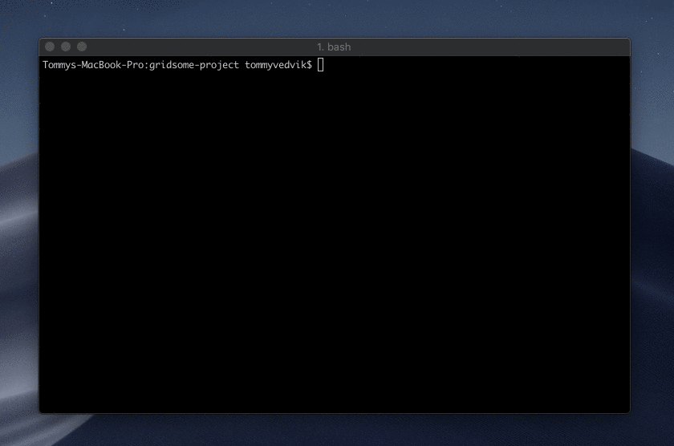

# How it works

This article will cover in details how the **Gridsome run commands** works and what's happening under the hood. There are currently two commands for Gridsome:

- `gridsome develop` starts a local  **development server**.
- `gridsome build` generates **production ready** HTML files.


## Gridsome develop

The `gridsome develop` command starts a **local development server** with hot-reloading for code/file changes and the **GraphQL data layer**. You can usually open the development server at `localhost:8080`, and explore the GraphQL data layer at `localhost:8080/___explore`.


**This is whats happening under the hood when running `gridsome develop` command:**

1. **Initialize** - Reads project configuration and initializing installed plugins etc.
2. **Load sources** - Source plugins fetch their data and update the internal store.
3. **Create GraphQL schema** - Generates the GraphQL schema from node types in store.
4. **Generate code** - Generates runtime code like routes, plugins etc.
5. **Bootstrap finish** - Starts the development server and shows the URLs in your console.

## Gridsome build

The `gridsome build` command prepares a project for **production**. This means it generates HTML files that are optimized and ready to be hosted and deployed to any FTP or static web host.



**This is what's happening under the hood when running `gridsome build` command:**

1. **Initialize** - Reads project configuration and initializing installed plugins etc.
2. **Load sources** - Source plugins fetch their data and update the internal store.
3. **Create GraphQL schema** - Generates the GraphQL schema from node types in store.
4. **Generate code** - Generates runtime code like routes, plugins etc.
5. **Bootstrap finish** - Creates a render queue with all pages and templates.
6. **Run GraphQL** - Executes all `page-query` queries and stores the results in `json` files.
7. **Compile assets** - Runs webpack to compile production-ready assets.
8. **Render HTML** - Renders all pages and templates into static `html` files.
9. **Process files** - Local files are copied to the `dist` folder.
10. **Process images** - Local images are processed and copied to the `dist` folder.


> Services like **Netlify** and **Zeit Now** lets you run `gridsome build` automatically from a **Git-repository** and hosts the generated files on a CDN for you. These services also have hooks that enable you to re-build the site after a Git-commit. Learn more about Git-based [deployment here](/docs/deployment).


## Vue.js Hydration

The `gridsome build` command generates **SEO-friendly HTML files** that can be hosted anywhere. These HTML files are optimized to load as fast as possible. After the HTML is loaded **Vue.js** takes over the HTML and **hydrates** into a fully **Vue-powered SPA**.

>  Hydration refers to the client-side process during which Vue takes over the static HTML sent by the server and turns it into dynamic DOM that can react to client-side data changes.

[Learn more about Vue.js and Client Side hydration](https://ssr.vuejs.org/guide/hydration.html)

#### Debugging hydration errors

Vue fails silently in production mode and doesn't give a warning about where hydration failed. Set `mode` to `development` in `chainWebpack` to activate warnings:

```js
chainWebpack (config) {
  config.mode('development')
}
```
